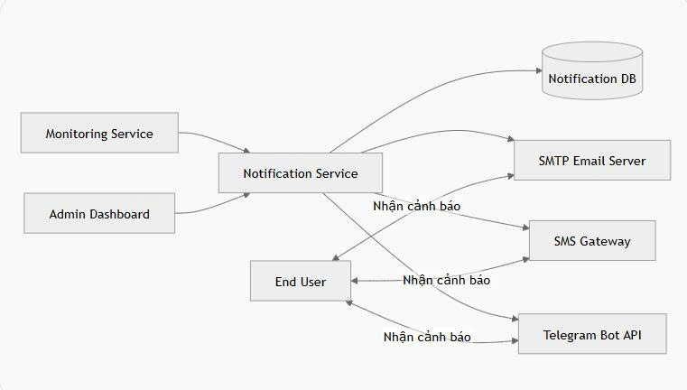

# Service Boundary của nhóm

## 1. Thông tin nhóm

- Tên nhóm: Nhóm 3
- Lớp: CNTT 17-09
- Thành viên: Nguyễn Xuân Anh, Vũ Đức Nguyễn Chuẩn, Tăng Tất Cương.
- Service nhóm phụ trách: B7: Xây dựng dịch vụ gửi cảnh báo đa kênh.
- Sản phẩm tổng thể của lớp: Smart Campus Operations Platform – Product B

## 2. Actor

Ai tương tác với hệ thống/service?
Các actor tương tác với service:

Quản trị viên hệ thống (Admin)
Các service khác trong hệ thống Smart Campus
Người dùng cuối nhận cảnh báo
Hệ thống giám sát thiết bị/camera/sensor
## 3. System Boundary

Nhóm em xây phần nào?

Phần nhóm kiểm soát:
Notification Service (dịch vụ gửi cảnh báo)
API nhận yêu cầu gửi cảnh báo
Xử lý nội dung cảnh báo
Gửi cảnh báo qua nhiều kênh:
Email
SMS
Telegram/WebSocket/Push Notification (nếu có)
Quản lý log gửi thông báo
Kiểm tra trạng thái gửi thành công/thất bại

Phần nhóm chỉ tích hợp:
Authentication Service
Monitoring Service
User Service
Database chung của hệ thống
SMTP server / SMS Gateway / Telegram Bot API

## 4. Service Boundary

Service của nhóm có trách nhiệm gì?
Service của nhóm có trách nhiệm
Nhận yêu cầu gửi cảnh báo từ service khác
Xác định kênh gửi cảnh báo
Gửi thông báo đến người dùng
Ghi log lịch sử gửi
Retry khi gửi thất bại
Trả trạng thái kết quả gửi

Service KHÔNG làm gì?
Service KHÔNG làm
Không quản lý đăng nhập người dùng
Không xử lý AI hoặc phân tích dữ liệu
Không lưu dữ liệu nghiệp vụ chính
Không giám sát camera/sensor trực tiếp
Không xác thực người dùng cuối
## 5. Input / Output

### Input

Input
Nội dung cảnh báo
Danh sách người nhận
Loại cảnh báo
Mức độ ưu tiên
Kênh gửi (email, SMS, push,...)

### Output

Output
Trạng thái gửi
Mã phản hồi
Thời gian gửi
Log lỗi nếu thất bại

## 6. API dự kiến

| Method | Endpoint                 | Mục đích                    |
| ------ | ------------------------ | --------------------------- |
| GET    | /health                  | Kiểm tra trạng thái service |
| POST   | /api/notifications/send  | Gửi cảnh báo                |
| GET    | /api/notifications/logs  | Xem lịch sử gửi             |
| POST   | /api/notifications/retry | Gửi lại cảnh báo thất bại   |
| GET    | /api/notifications/{id}  | Xem chi tiết thông báo      |


## 7. Phụ thuộc service khác

Service này gọi đến service nào?
Service này gọi đến
User Service → lấy thông tin người nhận
Auth Service → xác thực token
SMTP Server → gửi email
SMS Gateway → gửi SMS
Telegram Bot API → gửi Telegram

Service nào gọi đến service này?
Service gọi đến service này
Monitoring Service
Camera Service
IoT Sensor Service
Admin Dashboard
## 8. Sơ đồ minh họa
Có thể vẽ bằng Mermaid, draw.io, Ludichart hoặc ảnh chụp sơ đồ.

```mermaid
flowchart LR
    User[Actor] --> Service[Service của nhóm]
    Service --> DB[(Database)]
    Service --> Other[Service khác]